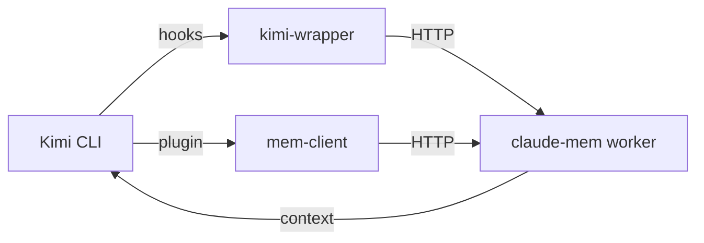

# kimi-mem 🧠

[](LICENSE)
[](https://nodejs.org/)
[]()

Persistent memory for [Kimi Code CLI](https://moonshotai.github.io/kimi-cli/), powered by the [claude-mem](https://github.com/thedotmack/claude-mem) engine.



## ✨ Features

- 🧠 **Persistent Memory** — Context survives across Kimi sessions
- 🔍 **Native Search Tools** — `mem_search`, `mem_timeline`, `mem_get_observations`
- 🌍 **Cross-Platform** — Windows, macOS, Linux
- 🚀 **One-Command Install** — `node install.mjs`
- 🌐 **Multi-Language** — French (`code--fr`), Spanish (`code--es`), English (`code`)

## 📋 Prerequisites

- Node.js ≥ 20
- [Kimi Code CLI](https://moonshotai.github.io/kimi-cli/)

## 🚀 Quick Install

```bash
# 1. Clone this repo
git clone https://github.com/YOUR_USERNAME/kimi-mem.git
cd kimi-mem

# 2. Run the installer
node install.mjs

# 3. Restart Kimi CLI
```

The installer will:
1. Install [Bun](https://bun.sh/) (if missing)
2. Install `claude-mem`
3. Register 7 lifecycle hooks in `~/.kimi/config.toml`
4. Install the native Kimi plugin
5. Set up auto-start (Windows Scheduled Task / macOS LaunchAgent)
6. Start the worker

## 🛠️ Manual Install

If you prefer to set things up manually, see [`docs/TROUBLESHOOTING.md`](docs/TROUBLESHOOTING.md).

## 🔧 Configuration

Edit `~/.claude-mem/settings.json`:

```json
{
  "CLAUDE_MEM_MODE": "code--fr"
}
```

Available modes: `code` (English), `code--fr` (French), `code--es` (Spanish), and more.

Then restart the worker:
```bash
bun ~/.claude-mem-install/node_modules/claude-mem/plugin/scripts/worker-service.cjs restart
```

## 🏗️ Architecture

| File | Purpose |
|------|---------|
| `install.mjs` | Cross-platform installer |
| `hooks/kimi-wrapper.mjs` | Translates Kimi hook JSON to claude-mem raw format |
| `plugin/plugin.json` | Declares native Kimi tools |
| `plugin/scripts/mem-client.mjs` | HTTP client to claude-mem worker |

## 🖥️ Web Viewer

Open http://localhost:37778 in your browser to browse memory in real time.

## ⚠️ Troubleshooting

See [`docs/TROUBLESHOOTING.md`](docs/TROUBLESHOOTING.md).

## 🤝 Contributing

See [CONTRIBUTING.md](CONTRIBUTING.md) for guidelines on bug reports, feature requests, and pull requests.

## 📜 License

This adapter is licensed under the **MIT License**.

The underlying memory engine is [claude-mem](https://github.com/thedotmack/claude-mem) by Alex Newman, licensed under **AGPL-3.0**.

## 🙏 Acknowledgements

- [claude-mem](https://github.com/thedotmack/claude-mem) — The persistent memory engine
- [Kimi Code CLI](https://moonshotai.github.io/kimi-cli/) — The AI coding assistant
